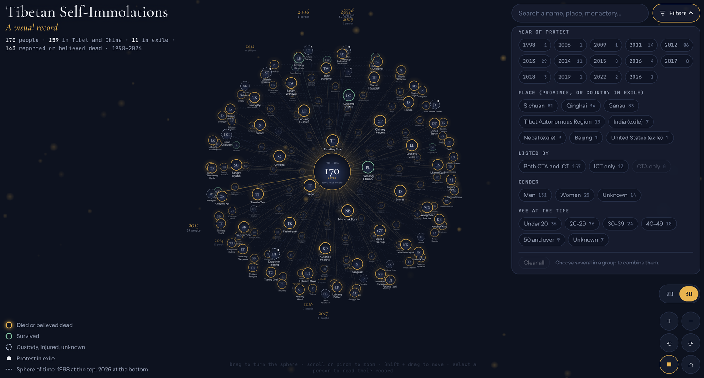

# Tibetan Self-Immolations: A Visual Record

**View the record: https://tenzin3.github.io/Tibetan-Self-Immolations-A-Visual-Record/**

*The 3D view, with the filter panel open. Each circle is one person, labelled with their name and date of protest, and every line leads to the centre. Gold rings mark people who died or are believed to have died, and white dots mark protests in exile. The panel on the right filters by year, place, source, gender and age; each option shows how many people it matches.*

This record brings together two lists of Tibetans who set themselves on fire in protest: the **Central Tibetan Administration (CTA)** fact sheet and the **International Campaign for Tibet (ICT)** fact sheet. It covers people inside Tibet and China since 2009 and people in exile since 1998. Each person is a circle, with their name and the date of their protest underneath, and all of them are linked to a single centre. Select anyone to read what is documented about them: age, home or monastery, where they protested, what happened to them afterwards, and where each fact comes from.

The record **updates itself every week** from ICT's fact sheet (see [How the record stays up to date](#how-the-record-stays-up-to-date)).

> **Content note.** This record concerns protest by self-immolation, and most of the people in it died. It contains no images of the protests.

---

## At a glance

<!-- figures:start -->
*Updated automatically from the sources. CTA table transcribed 2026-10-08; ICT fact sheet last checked 2026-10-09 (ICT's page last updated 2026-07-03).*

| | |
| --- | --- |
| People in this record | **170** |
| Inside Tibet and China | **159** (CTA lists 157; ICT lists 159; 157 appear in both) |
| In exile | **11** (India 7, Nepal 3, United States 1) |
| Reported to have died | **142**, plus **1** believed to have died |
| Survived | **9** |
| In custody, injured with no later report, or outcome unknown | **18** |
| Men / women / gender not stated | **131 / 25 / 14** |
| First and most recent | **Thubten Ngodrup, 1998-04-27** · **Lobga Rangzen, 2026-07-02** |

**Inside Tibet and China, by year:** 2009: 1 · 2011: 12 · 2012: 85 · 2013: 27 · 2014: 11 · 2015: 8 · 2016: 3 · 2017: 6 · 2018: 3 · 2019: 1 · 2022: 2

**By province:** Sichuan: 81 · Qinghai: 34 · Gansu: 33 · Tibet Autonomous Region: 10 · Beijing: 1
<!-- figures:end -->

Some figures from the CTA list alone (157 people inside Tibet and China):

- **2012** accounts for 85 people, more than half of the total. **November 2012** alone accounts for 28.
- Of the 136 people with an exact age, ages range from **15 to 81**, the median is **24**, and 99 were under 30.
- Of the 125 people whose death is recorded to the day, **104 died on the day of their protest**.

Most protests inside Tibet took place in the traditional Tibetan regions of Amdo and Kham, which are now divided among Chinese provinces. A year with no one listed does not prove that no protest took place.

---

## How to explore the record

### Two views
Switch with the **2D / 3D** buttons at the bottom right.

- **2D: a spiral of time.** People are placed in date order along a spiral, from the earliest nearest the centre to the most recent on the outer edge. Each year is labelled where it begins, with its count.
- **3D: a sphere of time.** The same people form a sphere around the centre, with the earliest at the top and the most recent at the bottom. Turn it in any direction to look around it.

In both views, every person has a line to the centre, and people who protested in exile carry a small white dot. A slow rotation runs until you pause it.

### Moving around
| To… | Mouse or trackpad | Phone or tablet |
| --- | --- | --- |
| Zoom in or out | scroll, or pinch | pinch |
| Move the graph | drag (2D) · Shift + drag (3D) | drag (2D) |
| Rotate | Shift + drag (2D) · drag (3D) · ⟲ ⟳ buttons | two-finger twist · ⟲ ⟳ buttons |
| Pause or resume the slow rotation | ❚❚ / ▶ button | ❚❚ / ▶ button |
| Return to the full view | ⌂ button | ⌂ button |

Names appear as you zoom in, then dates. Keyboard users can press `Tab` to move between people and `Enter` to open one. Other keys: `+` `−` zoom, `[` `]` rotate, arrow keys move or turn, `2` / `3` switch views, `0` resets, `F` opens the filters, and space pauses the rotation.

### Finding someone
- **Search** (top right) by name, other recorded names, place, monastery, province or year. Press Enter to go straight to the first match.
- **Filters**: open them with the **Filters** button and close them with **Hide** or `F`. You can filter by:
  - **Outcome**: died or believed dead; survived; or custody, injured or unknown
  - **Country of protest**: Tibet and China, India, Nepal, United States
  - **Year of protest**
  - **Place**: province inside Tibet and China, or country in exile
  - **Listed by**: both CTA and ICT, ICT only, or CTA only
  - **Gender**: men, women, or unknown
  - **Age at the time**: under 20, 20s, 30s, 40s, 50 and over, or unknown

  Choosing several options in one group adds them together (2012 *or* 2013). Choosing across groups narrows the list (women *and* 2012). Each option shows how many people it would match. While the panel is closed, your active filters appear as small tags that you can remove with one click.
- People who match stay bright, and everyone else fades. The centre shows how many are shown, for example "12 of 170 shown".

### Reading a person's record
Select a person, or the centre for an overview. The panel shows:

- **Where and who lists them**: Tibet and China or exile (with country), and whether the CTA, ICT or both list the person
- **Name** and any other names or spellings they are recorded under
- **Date of protest**, and if it was corrected, the date the CTA gives
- **Age** (marked as approximate when the source says "twenties", "late 30s" and so on), **gender**, **province or country**
- **Place of protest** and **monastery, village or occupation**
- **Parents**, where recorded
- **Outcome**: for people who died, the date of death and how many days after the protest; otherwise the status as reported
- **A source tag on every fact**: **CTA**, **ICT**, or **Corrected**, each linking to where the fact comes from
- **Unknown**, shown in grey, wherever neither source gives the information; nothing is guessed
- **Same day, same place**: others who protested with them
- **Notes on this record**: corrections (with the original value, the evidence and its certainty), and every point where the CTA and ICT disagree
- **As published by ICT** and **As published by the CTA**: each source's own wording, side by side, with a link to the person's entry on ICT's fact sheet
- **Sources**: every link behind the record

Use **Earlier** and **Later** (or ← →) to walk through the record in date order. Each person has their own link, for example `…/#cta-001` for Tapey, which you can share.

### What the colours mean
| Ring | Meaning |
| --- | --- |
| Glowing gold | Reported to have died, or believed to have died |
| Green | Survived: later released, or reported recovering |
| Dashed grey | Taken into custody, injured with no later report, or outcome unknown |
| Small white dot | Protest in exile |
| Initials inside the circle | No verified photograph has been added for this person yet |

---

## Sources

### The two lists
- **Central Tibetan Administration (CTA)**, *Fact sheet on Tibetan self-immolation protests in Tibet since February 2009*: https://tibet.net/important-issues/factsheet-immolation-2011-2012/
  157 people inside Tibet and China. Its page says it was last updated on 14 March 2022 and it has not been extended since, so it was transcribed once, on 8 October 2026, and reviewed. The CTA is the Tibetan administration in exile.
- **International Campaign for Tibet (ICT)**, *Self-immolation fact sheet*: https://savetibet.org/tibetan-self-immolations/
  159 people inside Tibet and China since 2009, and 11 in exile (page last updated 3 July 2026). It is read again **every week**. For each person, the record keeps ICT's date, place, age, whereabouts/wellbeing, monastery or occupation, every report linked from the entry, and a link to the entry itself. ICT's narrative text is not copied. ICT is an advocacy organisation.

### Other references
- **ICT**, compiled list of self-immolations (PDF, August 2024): https://savetibet.org/wp-content/uploads/2024/08/20240820-self-immolations.pdf
- **ICT**, map of self-immolations, 2009–2017: https://savetibet.org/why-tibet/self-immolations-by-tibetans/map-tibetan-self-immolations-from-2009-2013/
- **Radio Free Asia (RFA)**, report on Tsering Samdup, Kyegudo (Yushu), 30 March 2022: https://www.rfa.org/english/news/tibet/yushul-immolation-03312022125553.html
- Each person's panel also lists the ICT, RFA and other reports linked from their ICT entry.

### Contemporary reports behind individual corrections and checks
| Person | Report |
| --- | --- |
| Choephel | Human Rights Watch, open letter to the President of China, 3 Nov 2011: https://www.hrw.org/news/2011/11/03/open-letter-president-peoples-republic-china-self-immolations-tibetan-populated |
| Lobsang Tsultrim, Tennyi | ICT, 9 Jan 2012: https://savetibet.org/tibetan-self-immolations-continue-and-spread-in-tibet-into-2012/ |
| Sonam Rabyang | RFA, 9 Feb 2012: https://www.rfa.org/english/news/tibet/another-02092012170023.html |
| Sangay Dolma | ICT, *Acts of significant evil*, case details: https://savetibet.org/acts-of-significant-evil-case-details/ |
| Wangyal | Voice of America: https://www.voanews.com/a/three-tibetans-self-immolate-in-china-amid-protests/1553295.html |
| Kunchok Phelgye | ICT: https://savetibet.org/three-tibetans-self-immolate-in-two-days-during-important-buddhist-anniversary-images-of-troops-in-lhasa-as-tibetans-pray/ |
| Drukpa Khar | RFA, 17 Feb 2013: https://www.rfa.org/english/news/tibet/burning-02172013112417.html |
| Tsesung Kyab | ICT: https://savetibet.org/two-tibetans-self-immolate-at-monasteries-during-prayer-ceremonies-in-amdo/ |
| Kunchok Woeser | RFA, 24 Apr 2013: https://www.rfa.org/english/news/tibet/protests-04242013160540.html |
| Jamyang Losal | ICT: https://savetibet.org/young-tibetan-monk-becomes-the-150th-self-immolator-in-tibet/ |
| Tenga | ICT: https://savetibet.org/respected-tibetan-monk-sets-fire-to-himself-in-eastern-tibet/ |

---

## How the information was checked

1. **Every row of the CTA table** was transcribed: 157 people in table order. The CTA's own numbering repeats 119 and skips 109, so the position in the table is used instead. Original spellings, approximate ages ("20s", "late 30s") and missing values are kept as published. Gender is never guessed.
2. **Anomalies were compared with contemporary reporting**, such as dates that couldn't be right (a death recorded before the protest) and places that conflicted with other reports. Where strong evidence supported a different value, it was corrected. The CTA's original value is always kept and shown next to the correction.
3. **Totals were checked against the CTA's published summary.** The yearly counts and the 136 reported deaths match. The CTA summary counts 26 women; in the table itself, 25 are marked female and one has no gender marked.
4. **Outcomes are reported as historical claims.** "Died", "released" and "whereabouts unknown" describe what was reported at the time, not anyone's situation today. A missing death report is never treated as survival.

### How the two lists are merged
1. **One record per person.** An ICT entry and a CTA row are treated as the same person when their dates are within three days and their names are similar, allowing for different spellings (Phuntsok/Phuntsog, Sangdak/Sangdag).
2. **When spellings differ completely**, two entries are paired only if each list has exactly one unmatched person on that date, in the same province. At the first merge, this paired three people: Dopo / Dorbe (4 Nov 2018), Dupchok / Tsering (18 Jan 2013) and Kalsang Jinpa / Jinpa Gyatso (8 Nov 2012). Their records say so, and they are flagged for review in `data/merge-report.json`.
3. **The CTA's values (after corrections) come first.** ICT's values fill only what the CTA leaves empty. For example, ICT reports an outcome for six people the CTA lists as "Unknown", such as Dhargye (deceased) and Passang Lhamo (survived).
4. **Disagreements stay visible.** When the lists differ on a date, age, outcome or name, the person's notes give both versions. At the first merge, there were 8 differing ages, 4 dates, 3 outcomes and 3 names.
5. **People listed only by ICT** are added from ICT. At the first merge, these were 2 people inside Tibet (Drugkho, December 2018; Kunchok Tsomo, late March 2013) and all 11 exile cases. Anything ICT does not state, such as gender, is stored as **Unknown**.
6. **Outcomes keep ICT's wording.** "Believed deceased" is kept distinct from "deceased" (shown as *Believed to have died*). When ICT gives no whereabouts, the outcome is **Unknown**. This applies to several exile cases, even where ICT's narrative describes a death.

At the first merge, all 157 CTA people were matched to ICT entries, which together with ICT's 2 extra entries gives **159 inside Tibet and China, the same as ICT's published count**.

### Corrections applied (15)
| Person | What changed | From (CTA) | To | Certainty |
| --- | --- | --- | --- | --- |
| Choephel | date of protest | 7/11/2011 (after his recorded death) | 7 Oct 2011 | high |
| Lobsang Tsultrim | date of protest; date of death | 06/12/2012; 07/12/2012 | 6 Jan 2012; 7 Jan 2012 | high |
| Tennyi | date of protest; date of death | 06/12/2012 | 6 Jan 2012 | high |
| Sonam Rabyang | date of protest | 08/02/12 | 9 Feb 2012 | medium |
| Sangay Dolma | place | Dokarmo, Tsekhog, "Gansu Province" | Dokarmo town, Tsekhog (Zeku) County, Qinghai | high |
| Kunchok Phelgye | place; monastery | "Monk of Dringwa Sumdo monastery, Dzoege"; Gonda Dewa village | outside the main hall of Taktsang Lhamo Kirti monastery, Dzoege; previously Dringwa Sumdo monastery | high |
| Drukpa Khar | place | Amchok, Sangchu County, "Ngaba … Sichuan" | Amchok, Sangchu (Xiahe) County, Kanlho, Gansu | high |
| Kunchok Woeser | date of death | 24/4/2103 (misprint) | 24 Apr 2013 | high |
| Jamyang Losal | date of protest; date of death; place | 18 May 2017; in front of the Mani temple, Chentsa | 19 May 2017; near the county hospital, Chentsa | high |
| Tenga | place | main road near Kirti monastery, Ngaba | Kardze (Ganzi), Kham | high |

### Checked and left as published
- **Wangyal**: 26 November 2012 confirmed by Voice of America.
- **Tsesung Kyab**: 25 February 2013 confirmed by ICT's contemporary report.

### Still unresolved
- **Tadin Kyab / Tamdrin Kyab**: the CTA gives 22 November 2012, and ICT's compilation gives 23 November.
- **Sangdak**: the CTA gives 25 February 2013, and ICT's compilation gives 24 February.

These are shown in each person's record.

---

## What this record does not yet include

- **Tsering Samdup**, reported by RFA on 30 March 2022 in Kyegudo (Yushu), whose condition was unknown at the time of reporting. He is in neither fact sheet.
- **Updates to the CTA list.** The CTA list is kept as transcribed on 8 October 2026; only ICT's list is read weekly.
- **Photographs.** ICT shows a photograph for about 30 people, and the record stores each photo's address. Photos are not displayed until each person's identity and the right to use the image have been checked. Until then, each person is shown by their initials.
- **Exact locations.** Places are shown as published. No map is drawn, because a county name is not a precise location.

Multiple outlets repeating one witness account are not independent confirmation. Agreement between the CTA and ICT lists is a documentary check, not eyewitness verification.

---

## How the record stays up to date

A GitHub Actions workflow (`.github/workflows/pages.yml`) runs **every Monday**, on every change to the project, and whenever someone presses **Run workflow** on the repository's Actions tab. Each run:

1. **Reads ICT's fact sheet** and saves its entries to `data/ict-records.json`. If the page cannot be downloaded, or no longer looks like the fact sheet, the previous copy is kept and the run is marked with a warning.
2. **Merges** it with the CTA list, using the rules above, into the data the site uses. It also writes `data/merge-report.json` (how each ICT entry was matched) and refreshes the figures in *At a glance* above.
3. **Saves the changes** to the repository, only if something changed, and **republishes the site**.

The date ICT's list was last checked appears in *At a glance* and in the site's "About this record" panel (select the centre of the graph).

---

## For maintainers (brief)

- The site is in `site/` and opens directly in a browser. It is published to GitHub Pages by the workflow above. One-time setup: **Settings → Pages → Source → GitHub Actions**.
- `python3 scripts/fetch_ict.py` downloads ICT's fact sheet; `python3 scripts/build_records.py` merges everything. Both use only Python's standard library.
- If two entries are wrongly paired, or a pair is missed, record the decision in `research/match-overrides.json` (`same_person` / `different_people`, using ids from `data/merge-report.json`).
- To correct a CTA value, add it to `research/date-corrections.json` with its evidence.
- To add a portrait, save it as `site/portraits/<record id>.jpg`, register it with its credit and source link in `site/portraits/portraits.json`, and rebuild.
- `research/SOURCES.md` holds the full source review and the rules this record follows.
